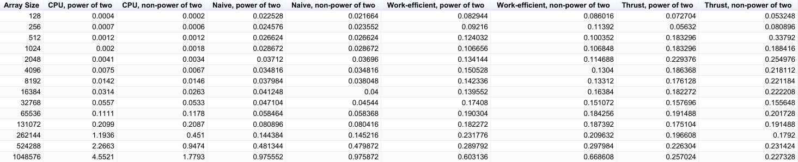
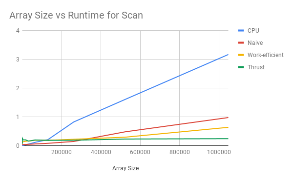
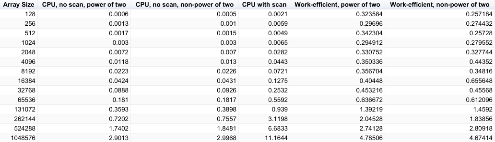
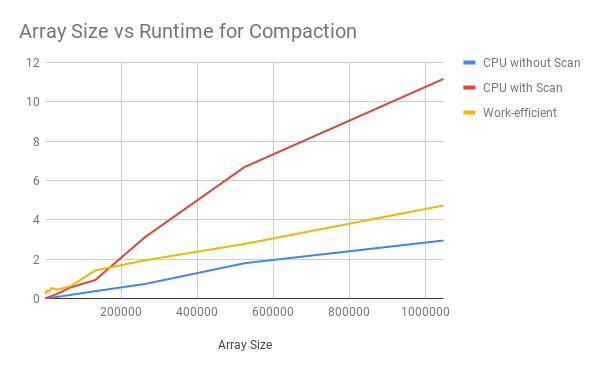

CUDA Stream Compaction
======================

**University of Pennsylvania, CIS 565: GPU Programming and Architecture, Project 2**

* Eric Chiu
* Tested on: Windows 10 Education, Intel(R) Xeon(R) CPU E5-1630 v4 @ 3.60GHz 32GB, NVIDIA GeForce GTX 1070 (SIGLAB)

## Description

This project explores and compares different CPU and GPU implementations of the scan (prefix sum) and the compaction algorithms. Some implementations include naive and work efficient methods.

## Performance Analysis


The following images below show a comparison between CPU, naive, work-efficient, and thrust implementations of the scan algorithm.







The following images below show a comparison between CPU without scan, CPU with scan, and work-efficient implementations of the compaction algorithm.







Overall, the thrust implementation had the best performance long term. In the beginning with smaller array sizes however, the CPU implementation was the fastest, then naive implementation, then work-efficient implementation, and then thrust implementation. As the array size increased, different implementations experienced different bottlenecks. I believe the CPU implementation experienced a bottleneck in the number of operations because it goes through serial memory processing (as to parallel memory processing). I believe the naive and work-efficient implementations experienced a bottleneck in global memory access. 


## Program Output

```
****************
** SCAN TESTS **
****************
    [  26  38   4  11  28  35   3   0   3   4  36   3  39 ...  22   0 ]
==== cpu scan, power-of-two ====
   elapsed time: 0.0006ms    (std::chrono Measured)
    [   0  26  64  68  79 107 142 145 145 148 152 188 191 ... 6071 6093 ]
==== cpu scan, non-power-of-two ====
   elapsed time: 0.0007ms    (std::chrono Measured)
    [   0  26  64  68  79 107 142 145 145 148 152 188 191 ... 6031 6046 ]
    passed
==== naive scan, power-of-two ====
   elapsed time: 0.023552ms    (CUDA Measured)
    passed
==== naive scan, non-power-of-two ====
   elapsed time: 0.023552ms    (CUDA Measured)
    passed
==== work-efficient scan, power-of-two ====
   elapsed time: 0.095232ms    (CUDA Measured)
    passed
==== work-efficient scan, non-power-of-two ====
   elapsed time: 0.105472ms    (CUDA Measured)
    passed
==== thrust scan, power-of-two ====
   elapsed time: 0.058368ms    (CUDA Measured)
    passed
==== thrust scan, non-power-of-two ====
   elapsed time: 0.05632ms    (CUDA Measured)
    passed

*****************************
** STREAM COMPACTION TESTS **
*****************************
    [   3   0   0   3   2   1   1   1   0   0   2   1   1 ...   2   0 ]
==== cpu compact without scan, power-of-two ====
   elapsed time: 0.0009ms    (std::chrono Measured)
    [   3   3   2   1   1   1   2   1   1   3   2   1   2 ...   1   2 ]
    passed
==== cpu compact without scan, non-power-of-two ====
   elapsed time: 0.0009ms    (std::chrono Measured)
    [   3   3   2   1   1   1   2   1   1   3   2   1   2 ...   2   2 ]
    passed
==== cpu compact with scan ====
   elapsed time: 0.0035ms    (std::chrono Measured)
    [   3   3   2   1   1   1   2   1   1   3   2   1   2 ...   1   2 ]
    passed
==== work-efficient compact, power-of-two ====
   elapsed time: 0.365568ms    (CUDA Measured)
    passed
==== work-efficient compact, non-power-of-two ====
   elapsed time: 0.359424ms    (CUDA Measured)
    passed
Press any key to continue . . .

```